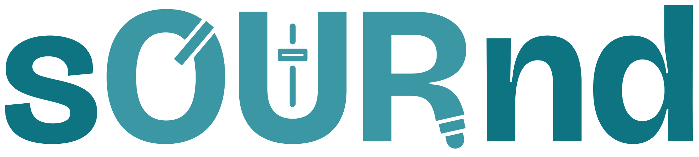
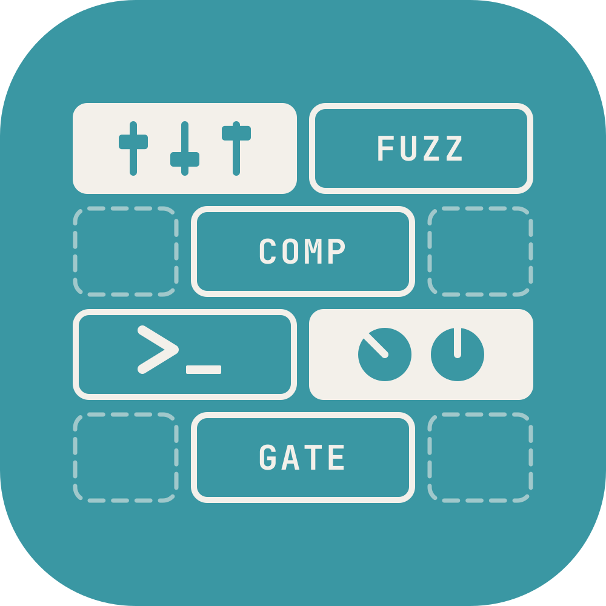
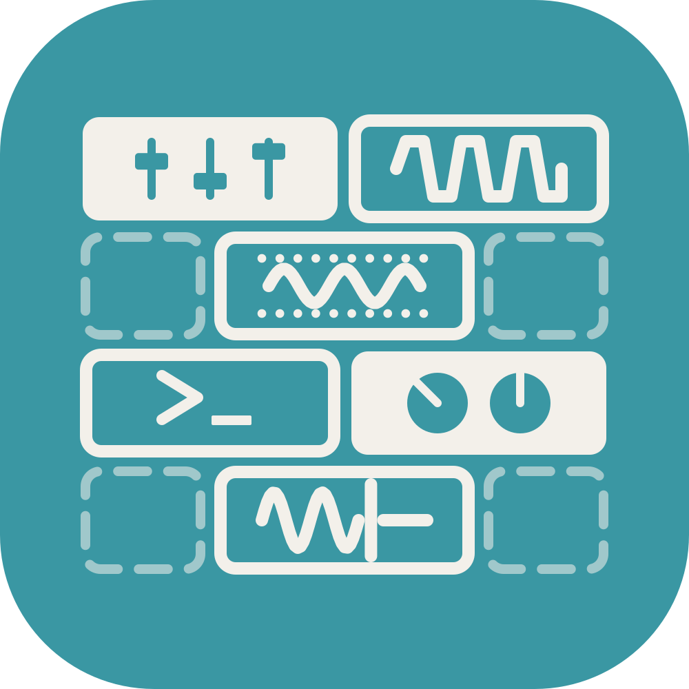
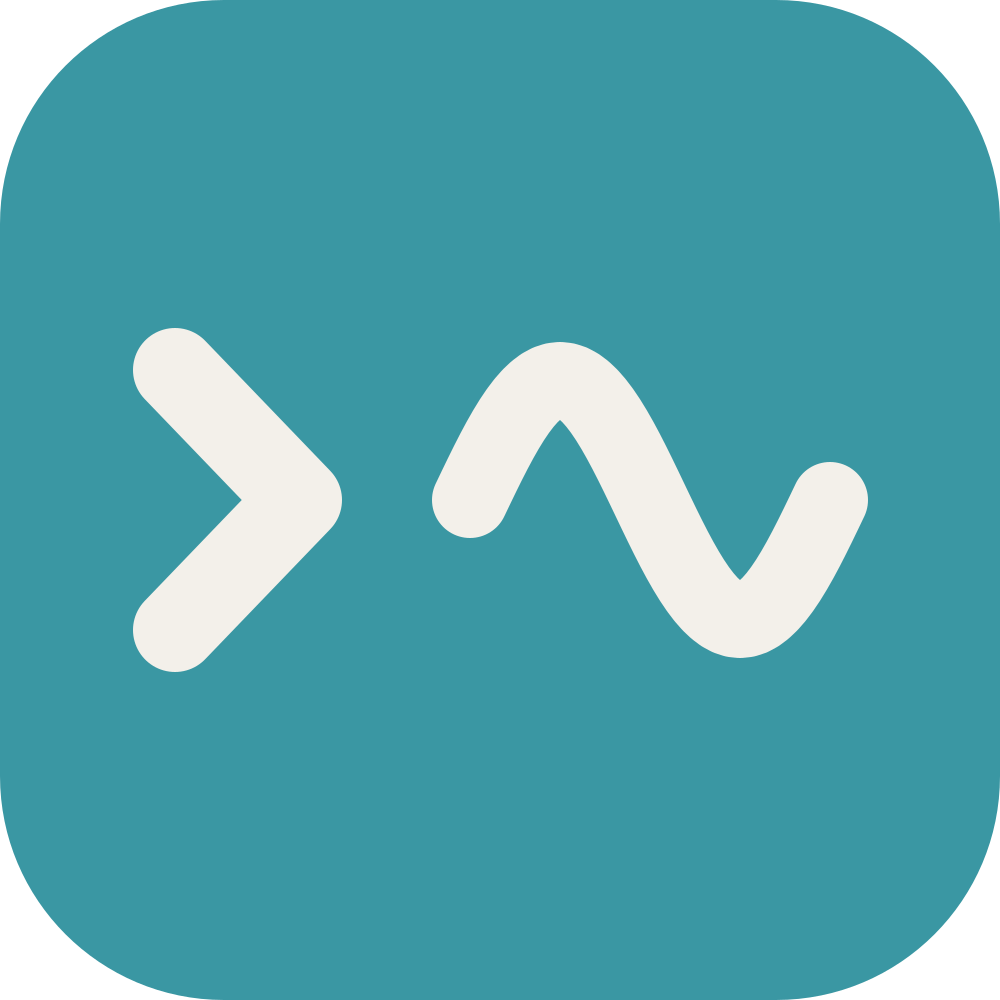
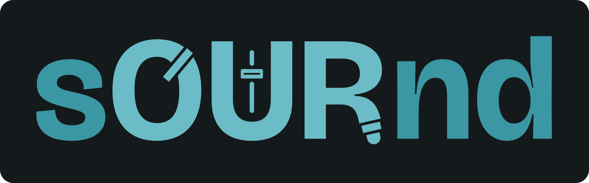
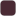
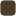

<!-- Generated from tools/README.template.md by tools/build_readme.py. Edit the template, not this file. -->

<p align="center">
  <picture>
    <source media="(prefers-color-scheme: dark)" srcset="marks/sournd-wordmark-dark.svg">
    
  </picture>
</p>

<p align="center"><b>Making what you need to make music.</b></p>

<p align="center">
  &nbsp;&nbsp;
  &nbsp;&nbsp;
  
</p>

# sournd brand assets

One source for the sournd wordmark, icon, colour, type and interface rules, installable in every
language we build with. The site, the Builder app, iOS and plugin faces all take their look from
here.

> An independent audio framework, builder and marketplace built around using generative processes
> and systems to create audio tools that are scaleable and compatible by design and default, with
> the ability to drop in or use pre-existing engines. Build a plugin around your favourite sound,
> without being held hostage to the original source; while it would be great if we could own
> everything, there aren't enough resources and energy on planet earth for us all to own a studio's
> worth of equipment.

**Tone:** warm, direct, confident.

## Install

| Where | Install | Read the tokens |
|---|---|---|
| Node, Vite, the browser | `npm install github:sournd/assets` | `import { tokens } from '@sournd/assets'` |
| PHP, Laravel | Composer `vcs` repository, `sournd/assets` | `Sournd\Assets\Assets::tokens()` |
| Python | `pip install git+ssh://git@github.com/sournd/assets.git` | `sournd_assets.tokens()` |
| Swift (iOS, macOS) | Swift Package Manager: `git@github.com:sournd/assets.git` | `SourndAssets.tokens` |
| Rust | `sournd-assets = { git = "ssh://git@github.com/sournd/assets.git" }` | `sournd_assets::TOKENS_JSON` |
| Figma, Tokens Studio | Import `tokens/dtcg/core`, `light` and `dark` | Variables, Light and Dark modes |

Every package has the same helpers: the tokens, a path to any file, the wordmark for a theme and the
right icon cut for a pixel size. Examples for each are at the end of this page.

## Wordmark

| On paper | On night |
|---|---|
|  |  |

sOURnd, with OUR capitalised, set in Bricolage Grotesque Bold, one weight.

- **O** carries a knob pointer at 40°.
- **U** is a fader, its thumb in the upper third.
- **R** has a leg that ends in a jack.
- Every separation is a cut through the letter, so the mark works on any background.
- In running text the name is written **sournd**.

| | s and nd | OUR |
|---|---|---|
| **Light** |  `#0E7482` |  `#3A97A3` |
| **Dark** |  `#3A97A3` |  `#6BBCC6` |

Two petrols, never an accent colour. On dark the whole word steps up one tone together.

| Rule | |
|---|---|
| Minimum size | 16px cap height. Below that, use the icon. |
| Clear space | The height of the n, all round. |

| File | |
|---|---|
| [`marks/sournd-wordmark-light.svg`](marks/sournd-wordmark-light.svg) | On paper and light surfaces |
| [`marks/sournd-wordmark-dark.svg`](marks/sournd-wordmark-dark.svg) | On night and dark surfaces |
| [`marks/png/`](marks/png) | PNGs 32, 64, 128 and 256px tall, both themes, transparent |

## Icon

A wall of blocks, showing a plugin being built: most slots empty and dashed, three named blocks
(FUZZ, COMP, GATE), a block of faders, a terminal prompt and a block of dials. The same tile in
light and dark mode.

| Cut | | Size | What changes |
|---|---|---|---|
| Full |  | 48px and up | Everything, with the block names written out |
| Small |  | 20 to 32px | Names become symbols: a clipped wave (fuzz), a wave between dotted thresholds (comp), a wave stopped at a line (gate) |
| Tiny |  | 16px | A prompt and a wave |

| Tile | Bricks |
|---|---|
|  `#3A97A3` |  `#F3F0EA` |

Corner radius 22.4% of the tile. Use the icon alone wherever there is no room for the word:
favicon, dock, title bars. Lockup: icon and wordmark side by side.

| File | |
|---|---|
| [`marks/sournd-icon-full.svg`](marks/sournd-icon-full.svg), [`small`](marks/sournd-icon-small.svg), [`tiny`](marks/sournd-icon-tiny.svg) | The three cuts as SVG |
| [`marks/png/`](marks/png) | 16 to 1024px, each size using its cut |
| [`web/`](web) | `favicon.ico` (16, 32, 48), `favicon.svg`, `apple-touch-icon.png`, `icon-192.png`, `icon-512.png` |

## Colour

| Swatch | Colour | Hex | Use |
|---|---|---|---|
|  | **Paper** | `#F3F0EA` | Light surface; text on petrol and raspberry buttons |
|  | **Ink** | `#1D2226` | Light text; text on amber and on the dark-mode primary |
|  | **Night** | `#141A1C` | Dark surface |
|  | **Chalk** | `#EDF0EE` | Dark-mode text only, never an accent |
|   | **Light petrol** | `#3A97A3`<br>dark `#6BBCC6` | THE primary accent: buttons, links, selection, focus, icon tile. Paper text on light; ink text on dark |
|   | **Deep petrol** | `#0E7482`<br>dark `#3A97A3` | Logo only (the s and nd) |
|   | **Raspberry** | `#9E1F4A`<br>dark `#E0577F` | Secondary accent: controls, control buttons, live states, knob pointers, fader thumbs, playhead. Never fills a surface or marks status. Paper text on it |
|  | **Amber** | `#F4A340` | Highlights (new, picks), never a warning. Ink text on it |
|   | **Muted** | `#545B60`<br>dark `#A7B1B3` | Secondary text and labels |
|   | **Control border** | `#7F868A`<br>dark `#6F7B7E` | 1px control borders |
|   | **Divider** | `#D9D5CC`<br>dark `#283235` | Dividers |

| Swatch | Text colour | Hex |
|---|---|---|
|  | Amber, as text on light | `#9A4A0B` |
|  | Raspberry, as text on dark | `#EE8FA6` |

- **Light petrol is the one accent:** buttons, links, selection, focus and the icon tile.
- **Raspberry is the colour of the thing you touch:** controls, knob pointers, fader thumbs, the
  playhead. It never fills a surface or marks status.
- **Amber highlights** new things and picks. It is never a warning.
- **Links** are ink with a 2px light petrol underline.
- **Status** is always a symbol and a word, never colour alone.

### Contrast

- Ink on paper 14.1:1.
- Paper on light petrol 3.0:1 (below AA, kept as a brand call: buttons use 500 weight at 15px or larger).
- Paper on raspberry 7.4:1.
- Ink on amber 7.8:1.
- Light petrol as text on paper 3.6:1, so links are ink with a light-petrol underline.
- Chalk on night 15.2:1.
- Dark primary #6BBCC6 on night 9.4:1, ink text on it 11.9:1.
- Raspberry as text on paper 7.4:1; on dark use #EE8FA6.

## Buttons

**On paper**

| Button | Rest | Hover | Pressed | Disabled | Label |
|---|---|---|---|---|---|
| **Primary** |  `#3A97A3` |  `#2E8591` |  `#0E7482` |  `#C9D9DB` |  `#F3F0EA` |
| **Secondary** |  `#7F868A` outline |  `#EDE9E2` |  `#DEDAD2` |  `#A19C93` |  `#1D2226` |
| **Control** |  `#9E1F4A` |  `#861A3F` |  `#6E1434` |  `#E3C7D1` |  `#F3F0EA` |
| **Highlight** |  `#F4A340` |  `#E8932C` |  `#D3821F` |  `#F7DDB8` |  `#1D2226` |

**On night**

| Button | Rest | Hover | Pressed | Disabled | Label |
|---|---|---|---|---|---|
| **Primary** |  `#6BBCC6` |  `#86CBD3` |  `#3A97A3` |  `#2A3F43` |  `#1D2226` |
| **Secondary** |  `#6F7B7E` outline |  `#1F292C` |  `#283235` |  `#5E6A6D` |  `#EDF0EE` |
| **Control** |  `#E0577F` |  `#E97396` |  `#9E1F4A` |  `#4A2A34` |  `#F3F0EA` |
| **Highlight** |  `#F4A340` |  `#F7B462` |  `#D3821F` |  `#4A3A28` |  `#1D2226` |

Hover darkens the fill one step (lightens it on night); pressed goes one more and drops 1px. Focus
is a 2px ring, offset 3px. Disabled is a tint of the fill with muted text, never opacity. Labels are
Instrument Sans 500 at 15px, 44px tall.

## Type

| Role | Face | Weight | Notes |
|---|---|---|---|
| Wordmark, display, headings, subheads | **Bricolage Grotesque** | 700 | Normal tracking. Never running text, labels or UI. |
| Body | **Instrument Sans** | 400 | |
| Interface | **Instrument Sans** | 500 | Buttons 15px |
| Labels | **Instrument Sans** | 600 | Uppercase, 0.08em tracking |
| Values | **Instrument Sans** | 600 | Tabular figures where numbers line up |

No monospace anywhere. Both faces are on Google Fonts and in Figma.

| File | |
|---|---|
| [`fonts/bricolage-grotesque/`](fonts/bricolage-grotesque) | Variable TTF (apps), woff2 (web), OFL.txt |
| [`fonts/instrument-sans/`](fonts/instrument-sans) | Variable TTF and woff2, roman and italic, OFL.txt |
| [`fonts/fonts.css`](fonts/fonts.css) | `@font-face` for both, for the web |

## Interface

| Thing | Value |
|---|---|
| Radius, controls | 6px |
| Radius, cards | 10px |
| Radius, modals | 12px |
| Height, inputs | 40px |
| Height, primary actions | 44px |
| Height, small | 32px |
| Height, chips | 28px |
| Control border | 1px  `#7F868A` (dark  `#6F7B7E`) |
| Divider |  `#D9D5CC` (dark  `#283235`) |
| Focus | 2px ring, 3px offset; ink on light, chalk on dark |

Icons are [Lucide](https://lucide.dev) at a 2px stroke.

## Tokens

| File | For |
|---|---|
| [`tokens/tokens.json`](tokens/tokens.json) | Every value above, with notes on use. The source for everything else. |
| [`tokens/tokens.css`](tokens/tokens.css) | CSS custom properties, `--sournd-*`, light, dark and system dark |
| [`tokens/dtcg/`](tokens/dtcg) | Design Tokens format: `core`, `light`, `dark` (Figma variables, Tokens Studio, Style Dictionary) |

## Versions

This kit is versioned on its own, in semver, and every release is tagged
([releases](https://github.com/sournd/assets/releases), [changelog](CHANGELOG.md)).

- **The major version is the brand generation.** A new sournd brand ships as a new major version,
  so pin the major your product was designed with: `0.x` today.
- **Minor versions** add files, sizes or packages without changing the look.
- **Patch versions** fix files.

Every package reports the version it carries: `version` (npm), `Assets::VERSION` (PHP),
`sournd_assets.__version__` (Python), `SourndAssets.version` (Swift), `sournd_assets::VERSION`
(Rust), and `$version` in `tokens.json`. Install a release by its tag, for example
`npm install github:sournd/assets#v0.1.0`.

## Using the packages

<details><summary><b>Node, Vite, the browser</b></summary>

```js
import { tokens, mark, icon, path } from '@sournd/assets';
import '@sournd/assets/fonts.css';
import '@sournd/assets/tokens.css';

tokens.colour.petrol.light;   // '#3A97A3'
mark('dark');                  // path to the dark wordmark
icon(32);                      // the small cut
```

```html
<button style="background: var(--sournd-btn-primary-rest); color: var(--sournd-btn-primary-text);
               border-radius: var(--sournd-radius-control); height: var(--sournd-height-primary);
               font: 500 15px var(--sournd-font-ui)">Browse the shop</button>
```
</details>

<details><summary><b>PHP, Laravel</b></summary>

```json
"repositories": [{ "type": "vcs", "url": "git@github.com:sournd/assets.git" }],
"require": { "sournd/assets": "dev-main" }
```

```php
use Sournd\Assets\Assets;

Assets::tokens()['colour']['petrol']['light'];  // '#3A97A3'
Assets::mark('dark');
Assets::icon(32);
Assets::path('web/favicon.ico');
```
</details>

<details><summary><b>Python</b></summary>

```python
import sournd_assets as brand

brand.tokens()["colour"]["petrol"]["light"]  # '#3A97A3'
brand.mark("dark")                           # pathlib.Path
brand.icon(32)
brand.path("web/favicon.ico")
```
</details>

<details><summary><b>Swift (iOS, macOS)</b></summary>

```swift
import SourndAssets

SourndAssets.registerFonts()           // once, at launch
SourndAssets.mark(.dark)               // URL of the dark wordmark
SourndAssets.icon(size: 32)            // the small cut
SourndAssets.tokens["colour"]          // decoded tokens.json
```
</details>

<details><summary><b>Rust</b></summary>

```rust
use sournd_assets::{icon_svg, wordmark_svg, Theme, TOKENS_JSON, FONT_INSTRUMENT_SANS};

let svg = wordmark_svg(Theme::Dark);   // embedded at compile time
let tiny = icon_svg(16);
```
</details>

<details><summary><b>Figma, Tokens Studio</b></summary>

Import `tokens/dtcg/core.tokens.json`, then `light.tokens.json` and `dark.tokens.json` as the
Light and Dark modes of one collection. Drag the SVGs from `marks/` in as vectors; they need no
fonts.
</details>

## Using the marks

Use the files as they are. Don't redraw, stretch, crop, recolour or add effects to the wordmark or
icon, and don't set the name in another typeface.

## Changing the brand

The specifications are in [`design/`](design). Everything else is generated and committed, so
installing never runs a build. To change the brand, see [`tools/README.md`](tools/README.md).

## Licences

- **Wordmark, icon and product imagery:** all rights reserved. Use them unmodified to refer to
  sournd.
- **Bricolage Grotesque and Instrument Sans:** SIL Open Font License 1.1 (`OFL.txt` beside each).
